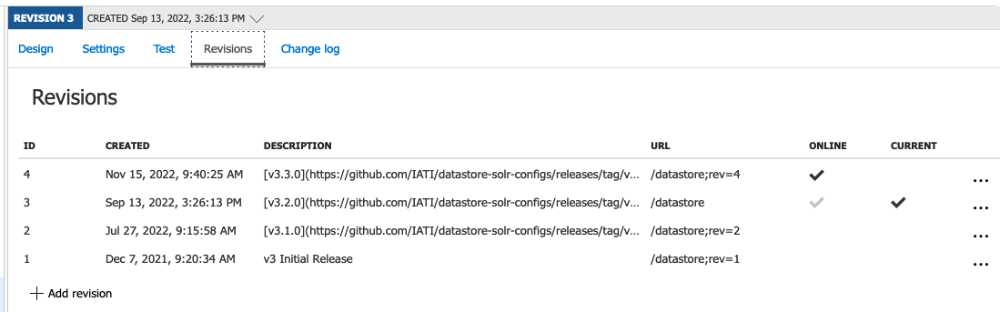

# apim-iati-gateway

## Prequisities

### For extractor tool

- Clone this repo `git clone <repo> --recurse-submodules`
  - Make sure to bring in submodule for extractor tool `extraction_templates/azure-api-management-devops-resource-kit` - https://github.com/Azure/azure-api-management-devops-resource-kit
- [Azure CLI](https://docs.microsoft.com/en-us/dotnet/azure/install-azure-cli)
- [.NET 6.0.0](https://docs.microsoft.com/en-us/dotnet/core/install/)

## Extracting

Run Extractor Tool bash script

```bash
cd extraction_templates
./extract_apis.sh
```

Update the Extractor Tool

- Update the submodule to the latest commit, then do the above

### Updating an Existing API Definition

- Make your changes on the `dev` APIM instance in the Portal as necessary
- If this is a Public API change (e.g. IATI Validator, IATI Datastore) that requires a new version bump/documentation then follow this process in the Portal:
  - Create a new Revision (APIs > Select API > Revisions > Add Revision)
  - Update the description following the strategy for previous releases/revisions. Basic markdown formatting is accepted.
  - Update documentation in the API definition (e.g. query params, response bodies, etc.)
  - Make the Revision current by selecting the `...` to the right of the revision row and selecting "Make Current"
  - Check the box to publish the change log, using the same documentation as the "Description" for the revision. Basic markdown formatting is accepted.
  - Leave the previous version (e.g. v3.2.0) online, as when this is deployed to Production the ARM templates cannot change the `online` status


Example of where you should be in `dev` before extracting if you were creating a `v3.3.0` version.

- Run the extractor tool bash script
- You should see changes to a number of the ARM templates and policies in `./service`
- NOTE: you need to manually remove the object with `"type": "Microsoft.ApiManagement/service/diagnostics"` from the `service/apim-iati-dev-apis.template.json` template, this is covered in the `service/apim-iati-dev-loggers.template.json` template.
- If there are any changes (new parameters) in `service/apim-iati-dev-parameters.json`, ensure that you update the github actions workflows to pass in the new parameters:
  - `apim-ci.yml`
  - `apim-develop.yml`
  - `apim-prod.yml`
- Create a feature branch, commit all changes to the feature branch
- Create a PR so that the ARM validation workflow runs
- If the validation workflow errors with "NoEffect" this is OK
- Merge the PR, the deployment to `dev` workflow will run
- Check in Portal and do testing to ensure the configuration has deployed successfully

### Adding a new API definition and/or backend

- If adding a new API definition with a new backend, you'll also need to get the backend configuration and parameterise it
  - Just make sure you don't wipe out the other backend paramterisation with the extractor tool
- See the `apim-iati-dev-backends.template.json` for and example of how this is done for existing APIs

## Making a Production Release

- Create a PR to merge `develop` -> `main`
- Merge the PR
- Create a Release in GitHub from `main`, increment the tag appropriately with semver standard
- Publish the Release, the `prod` deployment workflow will run
- If this is a Public API change (e.g. IATI Validator, IATI Datastore) that requires a new version bump/documentation, you'll have to make the new Revision Current/Online in the Portal after the deployment.
  - After deploy your Revisions should look like so in production:



- When you are ready to publish the new API you should then click the `...` and make the new version `v3.3.0` in this screenshot "Current".
- Check the box to publish the change log, using the same documentation as the "Description" for the revision. Basic markdown formatting is accepted.
- Once that's done it should look like:


- Check Portal/test that all your config made it there from `dev`
- PR from `main` -> `develop` to sync back to dev
- In Portal in `dev`, take the old version (e.g. v3.2.0) offline


- Then the final state will be:


- You'll then need to run the Extractor again and make a PR to sync that this API is offline now.

## Developer Portal

The developer portal look and feel customisation cannot be managed with ARM templates in source control.

It can be synced from Dev to PROD using a node script that utilises the Management API behind the scenes.

This is set up in a GitHub Actions Workflow that can be run manually from GitHub

[Workflow On GitHub](https://github.com/IATI/apim-iati-gateway/actions/workflows/apim-developer-portal-sync.yml) > Run Workflow

You can then check that the Developer Portal has been Published in the Portal [here](https://portal.azure.com/#@iatitech.onmicrosoft.com/resource/subscriptions/bcaf7a00-7a14-4932-ac41-7bb0dee0d2a9/resourceGroups/rg-apim-PROD/providers/Microsoft.ApiManagement/service/apim-iati-PROD/apim-portal)

The PROD_AZURE_CREDENTIALS Service Principal has been given Contributor role on both the Dev and Prod Resources so that it can move the resources between them.

## Backup

The APIM instance can be manually backed up by running the `apim-backup.yml` GitHub Actions workflow from GitHub. It is also set to backup the dev and prod instances nightly.

The backup is stored in a blob storage account in the same resource group as the APIM instance that it's backing up.

The Service Principal used to do the backups must have access to both Dev and Prod APIMs. So you can give the Prod Service Principle the "contributor" role on the scope of the dev resource group:

```bash
az role assignment create \
  --assignee <prod sp id> \
  --scope /subscriptions/<sub id>/resourceGroups/<dev resource group> \
  --role contributor
```

## Restore

Budget approximately 2-3hrs to complete a restore to a NEW Apim instance.

A backup can be [restored](https://docs.microsoft.com/en-us/powershell/module/az.apimanagement/restore-azapimanagement?view=azps-6.2.1) to a NEW apim instance with the following steps:

- [Install Azure Powershell](https://docs.microsoft.com/en-us/powershell/azure/install-az-ps?view=azps-6.2.1)
- Create a new APIM instance, e.g. `apim-iati-dr` in the appropriate resource group `rg-apim-dr`
  - The SKU of the service being restored into must match the SKU of the backed-up service being restored.
  - Timing: ~45min
- Create KeyVault Access Policies for the new APIM instance, so it can access `kv-iati-PROD`
- Use the below PowerShell commands to restore from the appropriate backup:
  - Example below: source backup is in a storage account `stapimiatibackupprod` in resource group `rg-apim-prod`, target apim instance is `apim-iati-dr` in resource group `rg-apim-dr`
- Change the CNAME records (`developer.iatistandard.org` and `api.iatistandard.org`) in Cloudflare to point to the new APIM instance URL
- Add the Custom Domain in the Azure Portal (doesn't seem to be copied with the backup)
  - Restore operation doesn't change custom hostname configuration of the target service.
  - Timing: ~20min
- Copy the Developer Portal content from `dev` to your new instance (modify TARGET_ENV in `apim-developer-portal-sync.yml`)

If just restoring to the existing `apim-iati-prod` instance, then only the PowerShell restore command would likely be neccessary.

```pwsh
PS >$storageKey = (Get-AzStorageAccountKey -ResourceGroupName "rg-apim-prod" -StorageAccountName "stapimiatibackupprod")[0].Value

PS >$storageContext = New-AzStorageContext -StorageAccountName "stapimiatibackupprod" -StorageAccountKey $storageKey

PS >Restore-AzApiManagement -ResourceGroupName "rg-apim-dr" -Name "apim-iati-dr" -StorageContext $StorageContext -SourceContainerName "backup" -SourceBlobName "backup_29_07_2021_1535"
```

Take note of considerations [here](https://docs.microsoft.com/en-us/azure/api-management/api-management-howto-disaster-recovery-backup-restore#constraints-when-making-backup-or-restore-request)

- Restore is a long running operation that may take up to 30 or more minutes to complete.
- [Constraints](https://docs.microsoft.com/en-us/azure/api-management/api-management-howto-disaster-recovery-backup-restore#constraints-when-making-backup-or-restore-request)
- [What is not backed up](https://docs.microsoft.com/en-us/azure/api-management/api-management-howto-disaster-recovery-backup-restore#what-is-not-backed-up)

# Resources

- [Azure/azure-api-management-devops-resource-kit](https://github.com/Azure/azure-api-management-devops-resource-kit)
- [Example Apim Devops](https://github.com/RvLabsMSFT/rvlabs-apim-devops)
